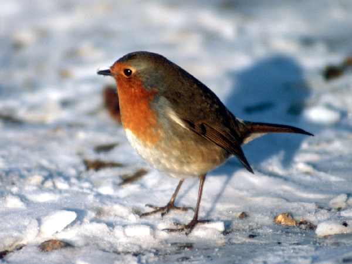

# STL List Lab

## Introduction

Read this in Chrome! :)

This lab is a simple example of using an STL List and iterating through it.

Unlike an STL vector, we cannot *randomly* access elements of the STL List - 
we must iterate through each element.

We can do this with Iterators in C++. This lab will step through how to do this.

## Turn-in

Upload your **.cpp**, **.hpp** (or **.h**) files.

## Group Work Policy

* Group work and/or collaboration is allowed for this assignment.
* You are allowed to research on the internet.
* You are allowed to ask the instructor for help.

## Setup

Make sure to download the following files:

* bird.ppm

You can also create your own image file to edit.
In GIMP, export as .ppm, and make sure to save it as an ASCII file.

---

## Reference

[C++ Reference - List](http://www.cplusplus.com/reference/list/list/)

---

# Writing the program

Include the following headers at the beginning of your program:

	#include <iostream>
	#include <fstream>
	#include <list>
	#include <string>

fstream is for file input/output - we will be reading in an image file
and writing an image back out.

In main, you will want to create a list of integers - name this variable **colors**.
Each pixel of the image is stored as a color value, which is what we're reading in.

## Reading in the image

Create an **ifstream** object, and load in the "bird.ppm" file.

The image file has a header before the actual image data, which looks like:

	P3
	# CREATOR: GIMP PNM Filter Version 1.1
	600 450
	255

we want to save this header for later - so you should create a string to
store the header.

You can use **getline** to read in lines of text from the image file.
See the solution below if you aren't very familiar with File I/O.

	
<strong>
		**Opening the file and saving the header**
	</strong>

	
	<pre>
	
	ifstream input( "bird.ppm" );
	string buffer;
	string header;
	
	// Save the header:
	getline( input, buffer ); // ascii code
	header += buffer + "\n";
	getline( input, buffer ); // comment
	header += buffer + "\n";
	getline( input, buffer ); // width/height
	header += buffer + "\n";
	getline( input, buffer ); // max color
	header += buffer + "\n";
	
	</pre>

	

After the header, all the contnets of the file are integers representing colors, each on their own line.
Create a temporary variable called **color** to store these numbers in, and then iterate through 
everything in the file, storing each color in the colors list.

	
<strong>
		**Iterating through the file, storing in a list**
	</strong>

	
	<pre>
	
	int color;
	while ( input >> color )
	{
		colors.push_front( color );
	}
	
	</pre>

	

Make sure to close the input file once done.

Note that for the code above, push_front is being used. We can also use
push_back with the List. As it is right now, the list will be reversed
when we output it back to a file.

## Writing out a modified image

Create an **ofstream** object to output a new image file (name it something
besides bird.ppm, but still something with .ppm at the end.)

First, make sure to output the header to the file.

Then, use a for loop and an iterator to output each color to the file.

Close the file once done.

	
<strong>
		**Iterating through the list of colors**
	</strong>

	
	<pre>
	
	ofstream output( "bird2.ppm" );	
	output << header;
	for ( list<int>::iterator it = colors.begin();
		it != colors.end();
		it++ )
	{
		output << *it << endl;
	}
	
	output.close();
	
	</pre>

	

Run the program and view the resulting image file.

(Note: It might take the program a while to write out the result)

## More changes

If you open up the .ppm file in a text editor, you will see values like this:

	P3
	# CREATOR: GIMP PNM Filter Version 1.1
	600 450
	255
	221
	221
	...etc...

If you've worked with HTML and CSS, you might remember that colors are
represented as hex numbers: #FF0000 is red, #00FF00 is green, and #0000FF is blue.

Each three sets of numbers represent red, green, and blue in this file.

You can use this information to make other changes...

### flipped.ppm

Flip the bird image without changing the colors - remember that colors
come in groups of 3. You might want to modify your color input code to something more like this:

	int r, g, b;
	while ( input >> r >> g >> b )
	{
		colors.push_back( r );
		colors.push_back( g );
		colors.push_back( b );
	}

Experiment by creating a second list of integers, and push the r, g, b values
to the "colorsBackwards" list in a different order so that, when it's output
back, you get an upside-down bird.

### removecolor.ppm

For this image, remove **one** color from the image by replacing it with 0.

Remember that the colors come in groups of 3, so you can use a counter and
the modulus operator to set each 3rd item to output "0" instead of the actual color.

### halfcolor.ppm

For this image, remove **one** color from the image by replacing it with 0.

Remember that the colors come in groups of 3, so you can use a counter and
the modulus operator to set each 3rd item to output half the current color instead of the actual color.
The image above is halving the blue values.
